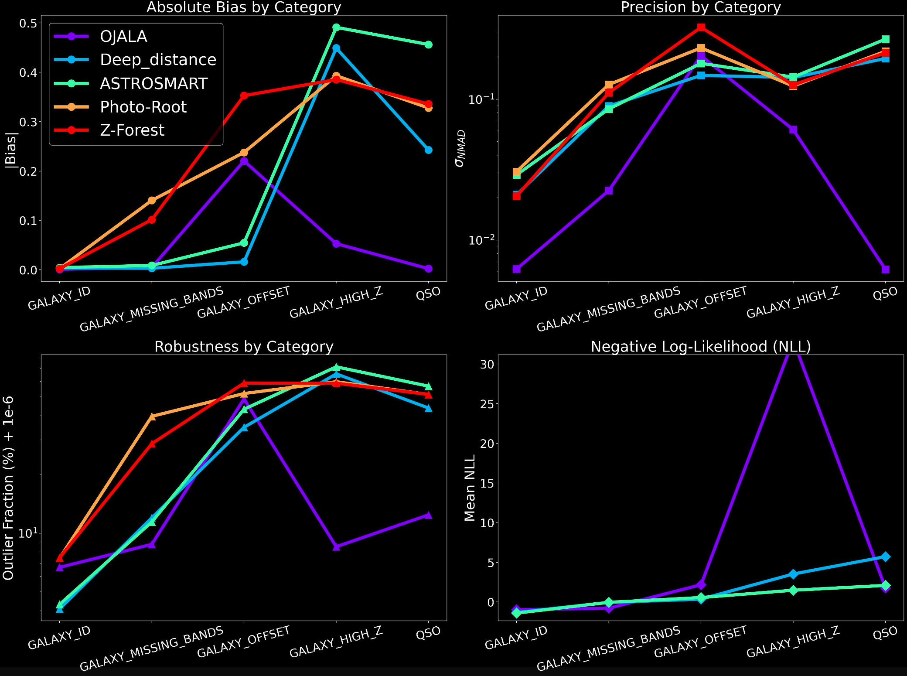

# Photo-Z Challenge: Environment Setup and Execution Guide


Welcome to the Photo-Z Challenge! This guide provides step-by-step instructions to set up your Python environment, install all required dependencies, and run the machine learning pipeline on your local machine. It is fully compatible with both Windows and macOS.

## 1. Prerequisites

You must have the following tools installed on your system before beginning:

* **Git:** Required to download the repository and version control your changes. You can download and install it from the official Git website (https://git-scm.com/downloads).
* **Miniconda (Recommended) or Anaconda:** This is the most reliable way to manage Python environments and complex libraries across different operating systems. Download it from the official Anaconda website (https://docs.anaconda.com/free/miniconda/).

## 2. Directory Structure Setup

For the pipeline to run smoothly without modifying any paths in the code, you need to set up a specific folder structure. The datasets must be placed in a `data` folder located at the level above the code repository.

Your final workspace should look exactly like this:

```text
Workspace_Folder/
├── data/
│   ├── training_set.h5
│   ├── validation_set.h5
│   └── blind_test_set.h5
└── photoz_challenge/
    ├── config.yaml
    ├── train_model.py
    └── ...
```

## 3. Download and Environment Setup

Open your terminal (macOS) or Anaconda Prompt (Windows) and execute the following commands in order.

**Step 3.1:** Clone the repository to your local machine.
```bash
git clone [https://github.com/gimarso/photoz_challenge.git](https://github.com/gimarso/photoz_challenge.git)
cd photoz_challenge
```

**Step 3.2:** Create the virtual environment with a base Python 3.10 installation using Conda, and activate it. You must do this every time you open a new terminal to run the project.
```bash
conda create -n photoz_env python=3.10 -y
conda activate photoz_env
```

**Step 3.3:** Install all necessary dependencies (PyTorch, Pandas, Matplotlib, JupyterLab, etc.) using `pip` and the `requirements.txt` file. This hybrid approach ensures optimal compatibility and faster installation.
```bash
pip install --upgrade pip
pip install -r requirements.txt
```


## 4. Running the Pipeline (Command Line)

Once your environment is active and your data is properly placed in the `./data/` directory, you can run the different stages of the pipeline sequentially using the provided Python scripts:

* **Train the Model:**
  Trains the ML algorithm using `training_set.h5` and saves the model weights in the `./models/` directory according to your `config.yaml`. By default, the pipeline includes two models: an Artificial Neural Network (ANN) and a Random Forest (RF). The Random Forest model is particularly useful as it can predict uncertainty by estimating the standard deviation across its individual trees. You can easily tune various hyperparameters in the `config.yaml` file; for instance, you can modify `hidden_layers`, `dropout_rates`, `epochs`, and `learning_rate` for the ANN, or adjust `n_estimators` and `max_depth` for the RF. Please note that these provided algorithms are just a baseline starting point—each team is expected to design and implement their own custom models.
  bash
  python train_model.py
  

* **Evaluate on Validation Set:**
  Loads the trained model, runs inference on `validation_set.h5`, and generates detailed evaluation plots (PDFs) in the `./pdf/` directory. The generated evaluation report includes the following visualizations:
  * **Page 1:** Scatter plots comparing Predicted vs True Redshift, displaying both point density and color-coding by iSDSS magnitude for Galaxies and QSOs.
  * **Page 2:** Binned performance metrics—Bias, precision ($\sigma_{NMAD}$), and Outlier Fraction—evaluated against iSDSS magnitude and True Z for Galaxies.
  * **Page 3 (Conditional):** Scatter plots showing the Negative Log-Likelihood (NLL) versus True Redshift. This page is only generated if your chosen model outputs predictive uncertainty (Z_PRED_STD).
  bash
  python test_validation.py
  

* **Generate Predictions for Blind Test Set:**
  The traditional test set has been replaced with a completely blind dataset (`blind_test_set.h5`). Because you do not have the true labels, this step does not evaluate metrics locally; instead, it runs inference to prepare your final challenge submission. Executing this script will output a CSV file containing your model's predictions (`Z_PRED`) alongside its estimated uncertainty (`Z_PRED_STD`), provided your algorithm supports error estimation.
  bash
  python predict_test_set.py
  

* **Visualize Datasets:**
  Generates diagnostic plots (Redshift distribution, Color-Magnitude, etc.) for a specific dataset. By default, it looks at the validation set, but you can pass any file path.
  bash
  python visualize_data.py --file ../data/validation_set.h5


## 5. Running the Pipeline (Jupyter Notebook)

Alternatively, you can run and interact with the pipeline using JupyterLab.

**Step 5.1:** Launch JupyterLab from your terminal (make sure the `photoz_env` environment is activated first):
```bash
jupyter lab
```

**Step 5.2:** Your default web browser will automatically open. Navigate through the directory tree, open the `.ipynb` notebook file included in the repository, and run the cells sequentially to execute the pipeline.


## 6. Model Evaluation & Challenge Metrics

The evaluation of models submitted to the Photo-Z Challenge is  designed to test standard predictive accuracy, robustness against Out-of-Distribution (OOD) data, and the ability to estimate predictive uncertainty. 

### 6.1 Training Set Composition
The model will learn from a baseline dataset representing nominal observational conditions. The training set is composed of:
* **Galaxies**: 300,000 samples restricted to redshifts where z < 1.
* **QSOs (Quasars)**: 20,000 samples with resdsfhit in the range 0 < z < 4.

### 6.2 Validation Set Composition
To monitor overfitting and assist in hyperparameter tuning during the training phase, a validation set is provided with the same underlying distribution as the training data:
* **Galaxies**: 30,000 samples with z < 1.
* **QSOs**: 5,000 samples  with resdsfhit in the range 0 < z < 4.

### 6.3 Test Set & Out-of-Distribution (OOD) Scenarios
The final test set consists of 150,000 total unique instances divided equally into five distinct categories of 30,000 samples each to rigorously test model resilience:
* **GALAXY_ID**: The baseline control group consisting of standard galaxies with z < 1.
* **GALAXY_MISSING_BANDS (OOD)**: Galaxies where between 50% and 100% of the J-PAS photometric bands have been randomly masked and replaced with NaN values.
* **GALAXY_OFFSET (OOD)**: Galaxies where between 0 and 20 photometric bands have been multiplied by an extreme random offset factor ranging between -20 and 20.
* **GALAXY_HIGH_Z (OOD)**: Galaxies located at higher redshifts beyond the training distribution, i.e. 1 < z < 1.6
* **QSO**: Quasars spanning the full redshift range.

### 6.4 Optimization Metrics
For each category, predictions are evaluated by comparing the predicted redshift ($z_{pred}$) to the true redshift ($z_{true}$). We define the redshift error as $\Delta z = z_{pred} - z_{true}$. The specific metrics optimized are:

* **Bias**: Measured as the median of the redshift error.
* **Precision ($\sigma_{NMAD}$)**: The Normalized Median Absolute Deviation, which provides a robust measure of the spread of the error. It is defined as:

  $$1.4826 \times \mathrm{median}\left(\frac{|\Delta z - Bias|}{1 + z_{true}}\right)$$

* **Outlier Fraction ($\eta$)**: The proportion of catastrophic failures where the prediction deviates significantly from the truth. An outlier is defined as any prediction where:
  $$|\Delta z| > 0.15 \cdot (1 + z_{true})$$

### 6.5 Model Uncertainty (NLL)
Models are highly encouraged to predict not just a point estimate ($z_{pred}$), but also the uncertainty of that prediction via a standard deviation column (`Z_PRED_STD`, denoted as $\sigma$). If provided, the pipeline calculates the Negative Log-Likelihood (NLL) to evaluate the quality of these confidence bounds. Assuming a Gaussian error distribution, the NLL for a given prediction is defined as:

$$NLL = \frac{1}{2} \ln(2\pi\sigma^2) + \frac{(z_{pred} - z_{true})^2}{2\sigma^2}$$

Models that successfully predict reliable uncertainties will receive a reduction in their loss via a bonus reward. This is calculated using the mean NLL ($\overline{NLL}$) as follows:
$$Bonus_{NLL} = 0.05 \times \max(0, 1.0 - \overline{NLL})$$

### 6.6 The Challenge Loss Function
The ultimate ranking in the challenge is determined by a Loss function. 

First, the loss for each individual data category ($Loss_{cat}$) is calculated by combining the absolute Bias, the $\sigma_{NMAD}$, and the Outlier Fraction ($\eta$), while subtracting the uncertainty bonus:
$$Loss_{cat} = |Bias| + \sigma_{NMAD} + \eta - Bonus_{NLL}$$

Finally, the total score is computed as the weighted sum of the individual category losses:
$$Loss_{Total} = \sum_{cat} W_{cat} \times Loss_{cat}$$

The weights ($W_{cat}$) reflect the challenge priorities, placing heavy emphasis on standard performance while enforcing baseline OOD robustness:
* **GALAXY_ID**: 0.30
* **GALAXY_MISSING_BANDS**: 0.20
* **GALAXY_OFFSET**: 0.20
* **GALAXY_HIGH_Z**: 0.20
* **QSO**: 0.10

<p align="center">
  
</p>


