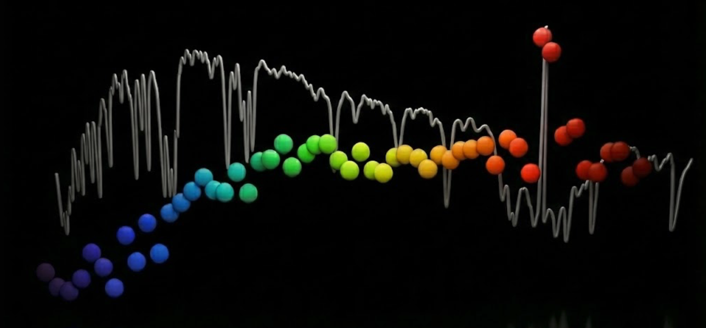
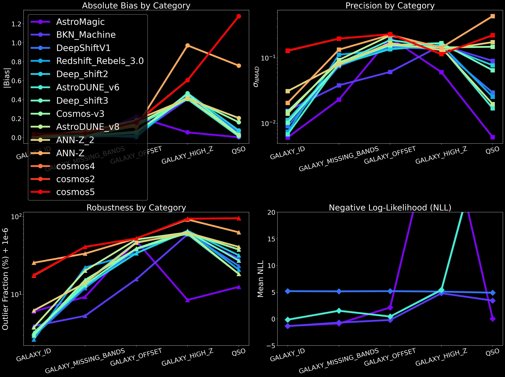
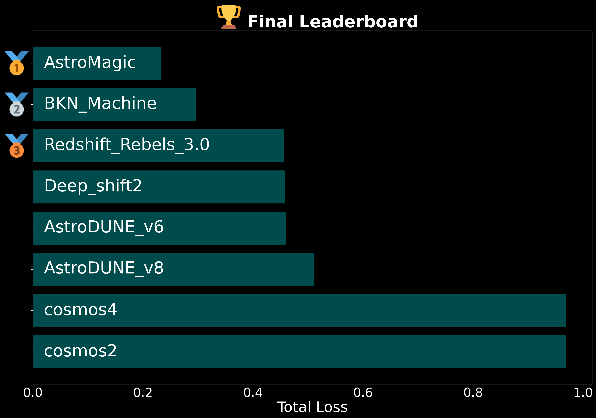

# Photo-Z Challenge: Environment Setup and Execution Guide




Welcome to the Photo-Z Challenge! This guide provides step-by-step instructions to set up your Python environment, install all required dependencies, and run the machine learning pipeline on your local machine. It is fully compatible with both Windows and macOS.

## 1. Prerequisites 🛠️

You must have the following tools installed on your system before beginning: 🚀

* 🐙 **Git:** Required to download the repository and version control your changes. You can download and install it from the official Git website (https://git-scm.com/downloads).
* 🐍 **Miniconda (Recommended) or Anaconda:** This is the most reliable way to manage Python environments and complex libraries across different operating systems. Download it from the official Anaconda website (https://docs.anaconda.com/free/miniconda/).


## 2. Directory Structure & Data Download 📂

For the pipeline to run smoothly without modifying any paths in the code, you need to set up a specific folder structure. The datasets must be placed in a data folder located at the level above the code repository. 


**Step 2.1:**  Create the directory structure

From your terminal, prepare your workspace by creating the necessary folders and cloning the repository to your local machine. 

```bash
git clone [https://github.com/gimarso/photoz_challenge.git](https://github.com/gimarso/photoz_challenge.git)
cd photoz_challenge
```

**Step 2.2:**  Download the Challenge Datasets 📥

The synthetic data (mocks) used for the challenge are hosted on the cloud of the Instituto de Astrofísica de Andalucía (IAA-CSIC).

* **Option A**: Direct Download (Browser)
Click on the following public link to download the complete folder as a ZIP file, and then extract its contents into your newly created Workspace_Folder/data directory:
```bash
https://cloud.iaa.es/index.php/s/mJmJMd5CQamyxoL/download
```
* **Option B**: Command Line (Terminal)
If you are working on a remote server or prefer using the terminal, you can download and extract the ZIP file directly into your data folder:
```bash
cd data
wget -O photoz_challenge_data.zip "https://cloud.iaa.es/index.php/s/mJmJMd5CQamyxoL/download"
```
Extract the data (.h5 files)
```bash
unzip photoz_challenge_data.zip
```
Clean up the zip file to save space and rearange the data folder
```bash
rm photoz_challenge_data.zip
mv photoz_data/* .
rm -rf photoz_data 
```


Your final workspace should look exactly like this: 👇

```text
Workspace_Folder/ 🖥️
├── data/ 📁
│   ├── training_set.h5 📄
│   ├── validation_set.h5 📄
│   └── blind_test_set.h5 📄
└── photoz_challenge/ 💻
    ├── config.yaml ⚙️
    ├── train_model.py 🐍
    └── ...
```


## 3. Download and Environment Setup ⬇️💻

Open your terminal (macOS 🍎) or Anaconda Prompt (Windows 🪟) and execute the following commands in order. 


**Step 3.1:** Create the virtual environment with a base Python 3.10 installation using Conda, and activate it.  You must do this every time you open a new terminal to run the project. ⚠️

```bash
conda create -n photoz_env python=3.10 -y
conda activate photoz_env
```

**Step 3.2:** Install all necessary dependencies (PyTorch, Pandas, Matplotlib, JupyterLab, etc.) using `pip` and the `requirements.txt` file. This hybrid approach ensures optimal compatibility and faster installation. 

```bash
pip install --upgrade pip
pip install -r requirements.txt
```


## 4. Running the Pipeline (Step‑by‑Step with Jupyter Notebooks) 📓🚀

The recommended way to participate in the Photo‑Z Challenge is through the provided **Jupyter Notebooks**, which guide you through the full workflow step by step.

This approach allows you to **visualize the data, train models, evaluate performance, and prepare submissions interactively**.

### Step 1 — Data Exploration & Visualization 🔍📊

Notebook: `step_1_data_visualization.ipynb`

The first step is to **explore and understand the datasets** before training any models.

In this notebook you will:

- Inspect the **training, validation, and blind datasets**
- Visualize **redshift distributions**
- Explore **color–magnitude relations**
- Inspect **example SEDs**
- Identify potential **selection effects or biases**

Understanding the data is essential before designing or training any machine learning model.


### Step 2 — Train Your Model 🧠🏋️

Notebook: `step_2_train_model.ipynb`

In this step you will train your machine learning model using the **training dataset**.

The notebook includes baseline implementations such as:

- **Artificial Neural Network (ANN)**
- **Random Forest (RF)**

The Random Forest can estimate prediction uncertainty using the **standard deviation across trees**, while the ANN allows flexible architecture design.

You can tune model hyperparameters through the `config.yaml` file, including:

- `hidden_layers`
- `dropout_rates`
- `epochs`
- `learning_rate`
- `n_estimators`
- `max_depth`

These baseline models are only starting points — teams are encouraged to design **their own models and improvements**.


---

### Step 3 — Validation & Performance Evaluation 📉📈

Notebook: `step_3_test_validation.ipynb`

This notebook evaluates the trained model using the **validation dataset**.

It generates diagnostic plots and metrics such as:

- **Predicted vs True Redshift scatter plots**
- **Bias, σ_NMAD, and Outlier Fraction**
- Performance as a function of **magnitude and redshift**
- Optional **Negative Log‑Likelihood (NLL)** analysis for probabilistic models

These diagnostics help identify:

- Biases in the predictions
- Performance degradation at faint magnitudes
- Model limitations or systematic trends

Participants are encouraged to **add their own diagnostic plots** to better understand their models.

---

### Step 4 — Generate the Challenge Submission 🏆

Notebook: `step_4_submit_predictions.ipynb`

The final step is to run inference on the **blind test dataset**.

This dataset **does not include true redshifts**, so it should only be used to generate predictions for submission.

Running this notebook will produce a CSV file containing:

- `Z_PRED` → predicted redshift
- `Z_PRED_STD` → predicted uncertainty (if available)

This file will be used as the **final challenge submission**.

---

## 5. Running the Pipeline (Command Line) 🏃‍♂️💻

Although the recommended workflow uses **Jupyter Notebooks**, the pipeline can also be executed directly from the command line.

This is useful for:

- running experiments on **remote servers**
- executing **automated training runs**
- integrating the pipeline into larger workflows

Once your environment is activated and the data is in `./data/`, the stages of the pipeline can be executed sequentially:

## Visualize Datasets

Generate diagnostic plots to inspect your data (such as **Redshift distribution** or **Color-Magnitude** diagrams ):

```bash
python plot_distributions.py --file ./data/validation_set.h5
```
You can also visualize the Spectral Energy Distribution of galaxies and QSOs for specific objects:

```bash
python plot_SED_objects.py

### Train the Model

```bash
python train_model.py
```

### Evaluate on Validation Set

```bash
python test_validation.py
```

### Generate Blind Test Predictions

```bash
python submit_predictions.py
```

The outputs (models, plots, and submission files) will be saved in the corresponding project directories.


## 6. Model Evaluation & Challenge Metrics 🏆📉

The evaluation of models submitted to the Photo-Z Challenge is designed to test standard predictive accuracy, robustness against Out-of-Distribution (OOD) data, and the ability to estimate predictive uncertainty. 

### 6.1 Training Set Composition 📊
The model will learn from a baseline dataset representing nominal observational conditions. The training set is composed of: 
* 🌌 **Galaxies**: 300,000 samples restricted to redshifts where z < 1.
* ✨ **QSOs (Quasars)**: 20,000 samples with redshift in the range 0 < z < 4.


### 6.2 Validation Set Composition 🧪
To monitor overfitting and assist in hyperparameter tuning during the training phase, a validation set is provided with the same underlying distribution as the training data: 
* 🌌 **Galaxies**: 30,000 samples with z < 1.
* ✨ **QSOs**: 5,000 samples with redshift in the range 0 < z < 4.

### 6.3 Test Set & Out-of-Distribution (OOD) Scenarios 🌪️🔬
The final test set consists of 150,000 total unique instances divided equally into five distinct categories of 30,000 samples each to rigorously test model resilience: 
* 🟢 **GALAXY_ID**: The baseline control group consisting of standard galaxies with z < 1.
* 🕳️ **GALAXY_MISSING_BANDS (OOD)**: Galaxies where between 50% and 100% of the J-PAS photometric bands have been randomly masked and replaced with NaN values.
* 📈 **GALAXY_OFFSET (OOD)**: Galaxies where between 0 and 20 photometric bands have been multiplied by an extreme random offset factor ranging between -20 and 20.
* 🔭 **GALAXY_HIGH_Z (OOD)**: Galaxies located at higher redshifts beyond the training distribution, i.e. 1 < z < 1.6
* 🌠 **QSO**: Quasars with redshift in the range 0 < z < 4.

### 📊 6.4 Optimization Metrics

For each category, predictions are evaluated by comparing the predicted redshift ($z_{pred}$) to the true redshift ($z_{true}$). We define the redshift error as $\Delta z = z_{pred} - z_{true}$. 📏

The specific metrics optimized are:

* ⚖️ **Bias**: Measured as the median of the redshift error.
* 🔍 **Precision ($\sigma_{NMAD}$)**: The Normalized Median Absolute Deviation, which provides a robust measure of the spread of the error. It is defined as:

  $$1.4826 \times \mathrm{median}\left(\frac{|\Delta z - Bias|}{1 + z_{true}}\right)$$

* 🚩 **Outlier Fraction ($\eta$)**: The proportion of "catastrophic failures" 🙀 where the prediction deviates significantly from the truth. An outlier is defined as any prediction where:
  
  $$|\Delta z| > 0.15 \cdot (1 + z_{true})$$

### 🎯 6.5 Model Uncertainty (NLL) 🎲

Models are highly encouraged to predict not just a point estimate ($z_{pred}$), but also the uncertainty of that prediction via a standard deviation column (`Z_PRED_STD`, denoted as $\sigma$). If provided, the pipeline calculates the Negative Log-Likelihood (NLL) to evaluate the quality of these confidence bounds. Assuming a Gaussian error distribution, the NLL for a given prediction is defined as:

$$NLL = \frac{1}{2} \ln(2\pi\sigma^2) + \frac{(z_{pred} - z_{true})^2}{2\sigma^2}$$

Models that successfully predict reliable uncertainties will receive a reduction in their loss via a bonus reward! 🎁✨ This is calculated using the mean NLL ($\overline{NLL}$) as follows ⬇️:

$$Bonus_{NLL} = 0.05 \times \max(0, 1.0 - \overline{NLL})$$

### 🏆 6.6 The Challenge Loss Function

The ultimate ranking in the challenge is determined by a Loss function. 🥇

First, the loss for each individual data category ($Loss_{cat}$) is calculated by combining the absolute Bias, the $\sigma_{NMAD}$, and the Outlier Fraction ($\eta$), while subtracting the uncertainty bonus: 

$$Loss_{cat} = |Bias| + \sigma_{NMAD} + \eta - Bonus_{NLL}$$

Finally, the total score is computed as the weighted sum of the individual category losses: 

$$Loss_{Total} = \sum_{cat} W_{cat} \times Loss_{cat}$$

The weights ($W_{cat}$) reflect the challenge priorities, placing heavy emphasis on standard performance while enforcing baseline OOD robustness: 

* 🌌 **GALAXY_ID**: 0.30
* 👻 **GALAXY_MISSING_BANDS**: 0.20
* 📏 **GALAXY_OFFSET**: 0.20
* 🔭 **GALAXY_HIGH_Z**: 0.20
* ✨ **QSO**: 0.10

### 🎁 6.7 Scalability Bonus: Level Up!

Any team that manages to bring their total loss below **0.35** will unlock a special reward! 

We will gift you an extra **Training Set + Validation Set**  to help you scale your model even further and reach new heights! 🚀 Show us what your architecture is capable of! 🔥


## 🏁 7. COMPETITION RESULTS 

Get a glimpse of the action! ⚡ Below are some examples of how the competition tracking and the final standings will look:

<p align="center">
  
  <br>
  <em>📈 Real-time performance tracking for your models!</em>
</p>

<p align="center">
  
  <br>
  <em>🏆 The race to the top: how the Leaderboard will be displayed.</em>
</p>

> [!NOTE]
> 💡 **Please note:** The images above are **mockups** to show you the look and feel of the competition. Your actual results will appear here once the challenge kicks off! 🚀
